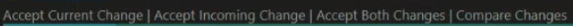

# Интструкция по работе с GIT и удавленными репозиториями

## Что такое Git?

Git - это одна из реализаций распределенных систем контроля версий, которая имеет локальные и удаленные репозитории. Самая популярная реализация систем контроля версий в мире.

## Подготовка репозитория 

Для создания репозитория необходимо выполнить команду *git init* в папке с репозиторием, что создает репозиторий (появлятся скрытая папка **.git**)

Основные этапы по работе с git
* Внести изменения;
* Сохранить изменения;
* Добавить изменения
* Зафиксировать/закоммитить файл

## Команды по работе с git

Опишем осовные команды по работе с git

### git init

Создает репозиторий внутри папки. 

[Подробнее о возможностях *git init*](https://git-scm.com/docs/git-init)

### git config

Позволяет залогиниться. Существуют 2 варианта действий:
* Выполнить команду *git config --global user.email "email адрес"*
* Выполнить команду *git config --global user.name "твое имя"*

[Подробнее о возможностях *git config*](https://git-scm.com/docs/git-config)

### git add

Добавляет файл или файлы к следующему коммиту

Чтобы использовать команду напишите *git add Имя файла* 

[Подробнее о возможностях *git add*](https://git-scm.com/docs/git-add)

### git commit

Добавляет коммит к версии файла с помощью команды *git commit -m "Комментарий"*.

Изменения комментария последней версии файла выполняется с помощью команды *git commit --amend -m "Новый комментарий"*

[Подробнее о возможностях *git commit*](https://git-scm.com/docs/git-commit)

### git status

Проверка состояния репозитория

[Подробнее о возможностях *git status*](https://git-scm.com/docs/git-status)

### git log

Проверка внесенных коммитов

[Подробнее о возможностях *git log*](https://git-scm.com/docs/git-log)

### git checkout

Перемещение между версиями

Перемещение между ветками

Команда *git checkout -b 'имя ветки'* позволяет создать и сразу перейти на нужную ветку

[Подробнее о возможностях *git checkout*](https://git-scm.com/docs/git-checkout)

### git diff

Позволяет увидеть разницу между сохраненным и зафиксированным файлом

[Подробнее о возможностях *git diff*](https://git-scm.com/docs/git-diff)

### git branch

Создает новую ветку. Для создания новой ветки необходимо воспользоваться командой *git branch имя ветки*

Для удаления ненужной ветки можно воспользоваться командой *git branch -d 'имя ветки'*

[Подробнее о возможностях *git branch*](https://git-scm.com/docs/git-branch)

### git merge

Производит слияние веток. Чтобы зафиксировать изменения из некотрой ветки необходимо использовать комманду *git merge*. Для фиксации изменений необходимо перейти сначала в ветку, в которую необходимо применить изменения, затем воспользоваться командой *git merge имя ветки*.

[Подробнее о возможностях *git merge*](https://git-scm.com/docs/git-merge)

## Конфликты при работе с разными ветками

Конфликты возникают когда затронуто общее рабочее пространство. При использовании команды *git megre* возникают варинты:

### Accept Current Change

Применяет изменения из текущей ветки

### Accept Incoming Change

Применяет изменения из ветки с которой изменения переносятся

### Accept Both Changes

Применяет оба изменения одновременно

### Compare Changes

Сравнивает изменения

## Работа с удаленными репозиториями

Различия удаленного и локального репозитория заключается в расположении репозитория. **Локальный** репозиторий расположен на личном компьютере. **Удаленный** репозиторий расположен в сети и нужен для работы в команды.

### Создание репозитория

На [github](https://github.com/) создание удаленного репозитория происходит при нажатии на зеленую кнопку *New*:

Для создания нужно задать уникальное имя

Существует 2 вида доступа:
1) публичный;
2) приватный.

Лучше всегда выбирать *Public*.

Любой удаленный репозиторий должен быть связан с локальным репозиторием.

### Привязка локального репозитория к глобальному

Есть 2 возможности:

1) Создание глобального репозитория и создание для него локального репозитория

2) Добавление существующего локального репозитория к созданному глобальному

Команды для обоих вариантов прописаны в [github](https://github.com/) после создание репозитория.

### Перенос изменений из локального в удаленный

Для переноса изменений из локального репозитория в глобальный достаточно после фиксации изменений выполнить команду *git push*.

### Перенос изменений из удаленного в локальный

Фиксируем изменения на [github](https://github.com/) в файле с помощью кнопки *Commit changes...*:

Для подтягивания изменений в локальный репозиторий необходимо выполнить команду *git pull*.

### Создание fork

Создается в основном на [github](https://github.com/). Это не сложно, не буду описывать.

Для добавления fork'a на локальный репозиторий используется команда *git clone ссылка на репозиторий*. После клонирования надо не забыть перейти в папку с репозиторием.

## Раздел для заметок

Место для написания заметок на тему git... Здесь какой-то другой текст для возникновения конфликта. Допишу что-нибудь еще.
Место для написания заметок на тему git... Добавляю текст для проверки работы конфликстов. Чуть чуть расширяю количество символов. 

## Еще один раздел для заметок

Здесь можно что-то писать.

